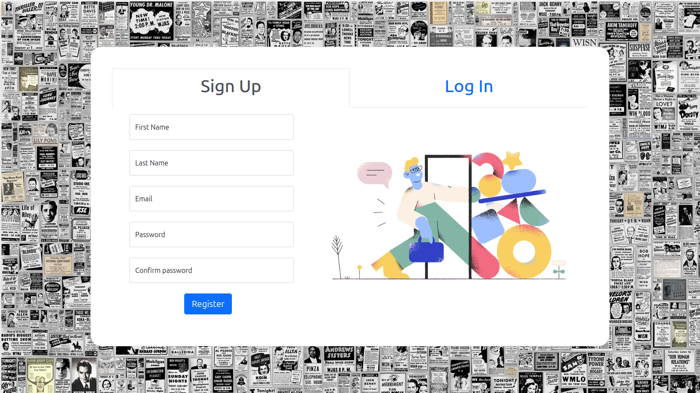
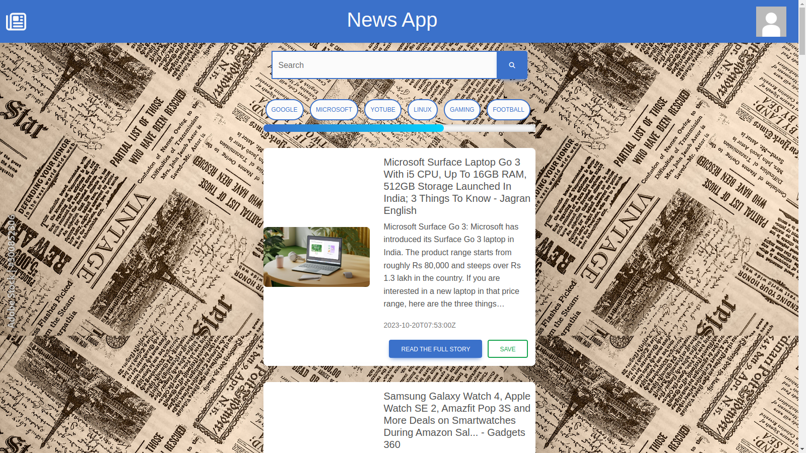

# Solo Project News App


## Overview
This is a web-based News App developed using Python with Flask and the NewsAPI to provide users with up-to-date news articles from various sources. It allows users to search for news articles by keywords, view headlines, and read full articles. This project is an excellent example of how to build a simple news aggregator web application.

## Features
- User-friendly web interface.
- Search for news articles by keywords.
- View top headlines from various sources.
- Responsive design for mobile and desktop.

## Prerequisites
Before you begin, ensure you have met the following requirements:

- Python 3.x installed.
- Flask framework installed.
- NewsAPI API Key (get it [here](https://newsapi.org/)).
- An internet connection to fetch news data.

## Getting Started
To get started with this project, follow these steps:

1. Clone this repository to your local machine:

    ```bash
    git clone https://github.com/yourusername/news-app.git
    ```

2. Change into the project directory:

    ```bash
    cd news-app
    ```

3. Create a virtual environment (recommended):

    ```bash
    python -m venv venv
    ```

4. Activate the virtual environment:

    - On Windows:

    ```bash
    venv\Scripts\activate
    ```

    - On macOS and Linux:

    ```bash
    source venv/bin/activate
    ```

5. Install the required packages:

    ```bash
    pip install -r requirements.txt
    ```

6. Create a `.env` file in the project root directory and add your NewsAPI API Key:

    ```bash
    NEWS_API_KEY=your_api_key_here
    ```

7. Run the Flask application:

    ```bash
    python app.py
    ```

8. Open your web browser and navigate to `http://localhost:5000` to use the News App.

## Usage
- Enter keywords in the search bar to find news articles related to your query.
- Click on headlines to read full articles.
- Enjoy up-to-date news!

## Contributing
Contributions are welcome! Please feel free to submit a pull request or open an issue.

## License
This project is licensed under the MIT License - see the [LICENSE](LICENSE) file for details.

## Acknowledgments
- [Flask](https://flask.palletsprojects.com/) - Python web framework.
- [NewsAPI](https://newsapi.org/) - API for fetching news articles.
- [Bootstrap](https://getbootstrap.com/) - Front-end framework for responsive design.
- [Font Awesome](https://fontawesome.com/) - Icons used in the project.

## Contact
If you have any questions or suggestions, feel free to contact us at your@email.com.

## Screenshots


